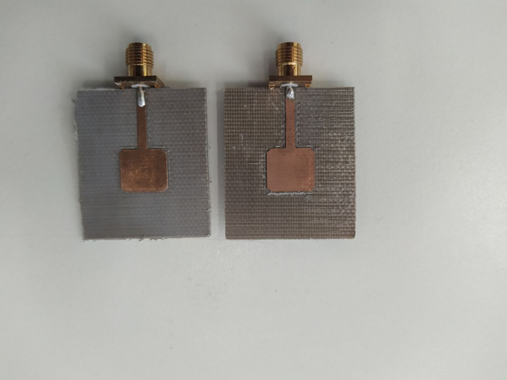
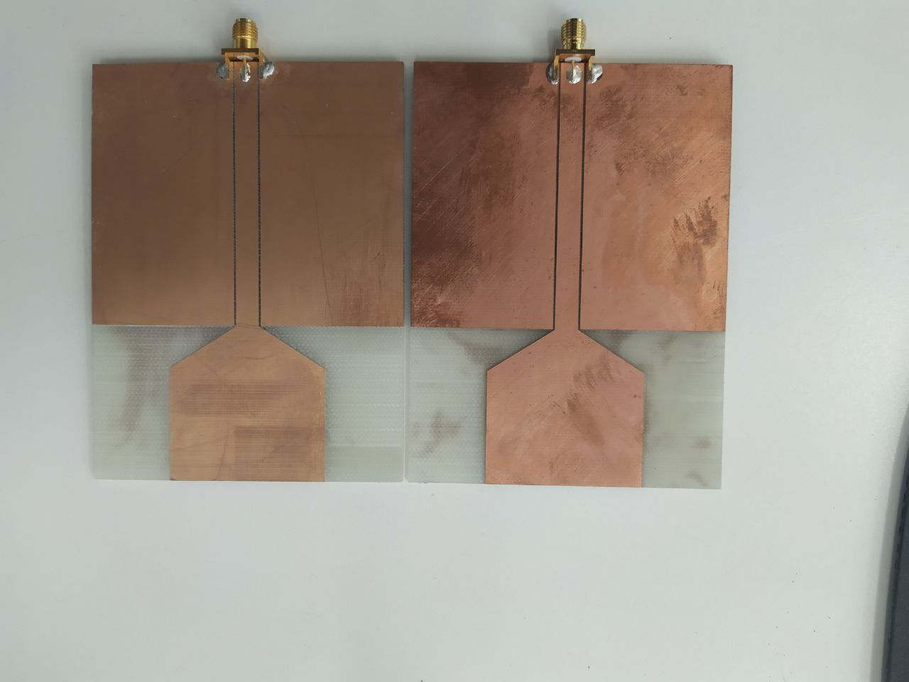
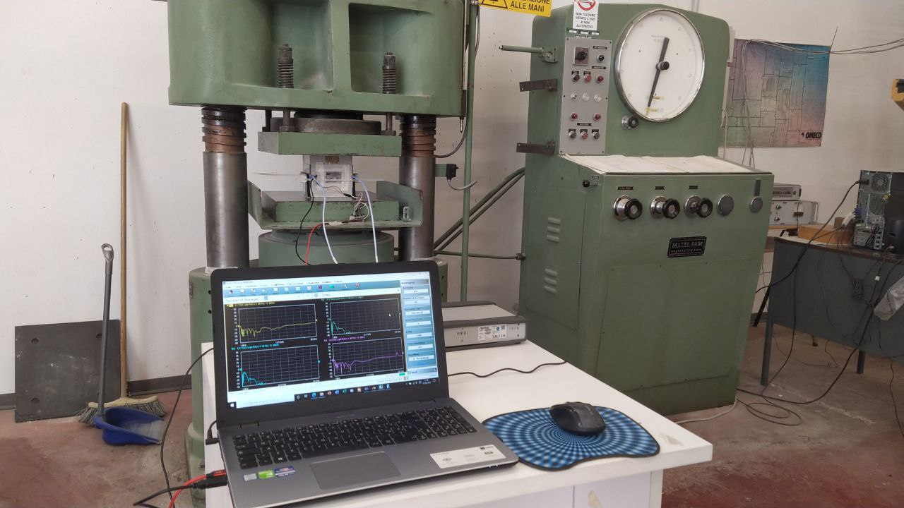

<h2>Overview</h2>
This project was aimed to search for effects of concrete degradation using  microwave applicatiors.
The objective was to research if the damages to the concrete structure could be identified from the scattering parameters.

The antennas were designed using FEKO, and realized on TLX-8 substrate and FR-4 using CNC milling.

Some images:

Antennas

Measurement setup:

