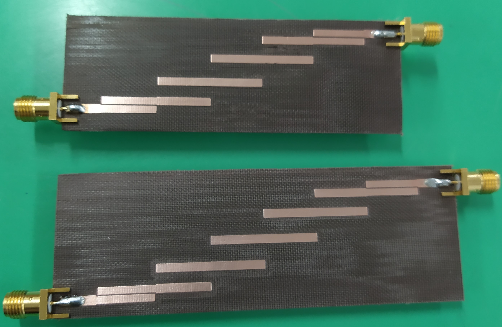
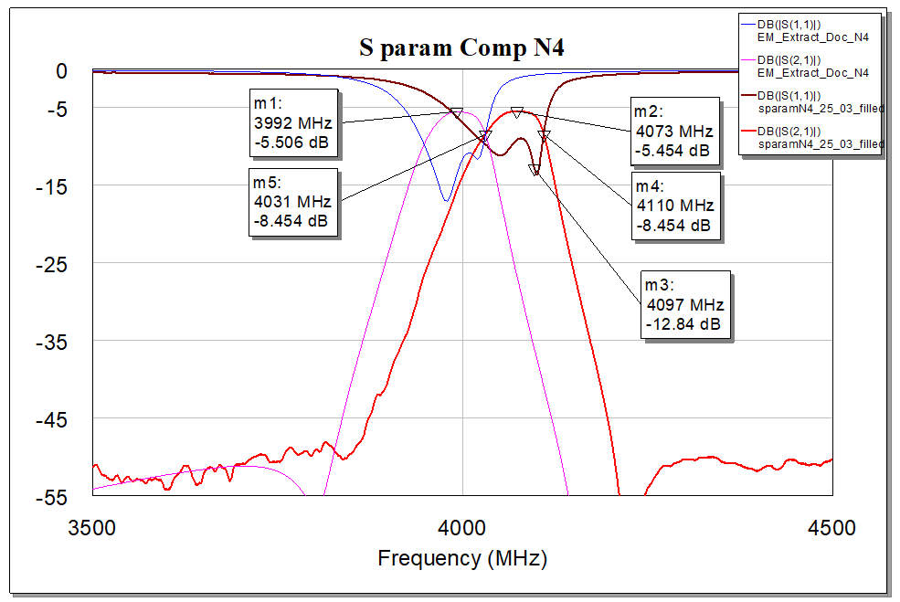
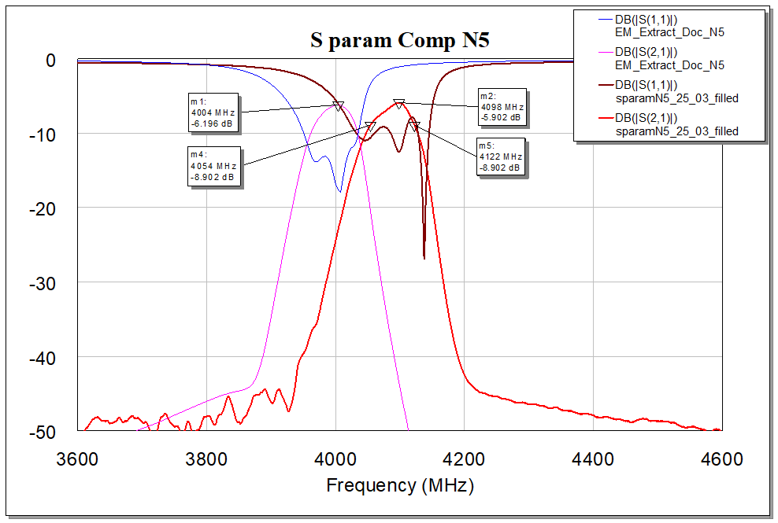

<h2>Overview</h2>
This project was carried on during the course of "Methods of RF design".
The objective was to realize some fiters using coupled microstrip lines at 5 GHz.

The filters were designed using AWR Microwave Office, and realized on TLX-8 substrate using CNC milling.

Some images:

Simulated vs realized:

