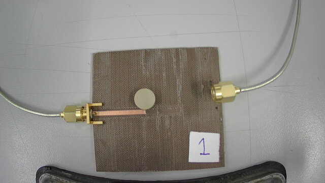

<h2>Overview</h2>
This project dealt with the design of a 5 GHz oscillator using dielectric resonators.

The circuit was designed using AWR Microwave Office, and realized TLX-8 using cnc milling.
The folder contains some images and measurements.

Some images:

