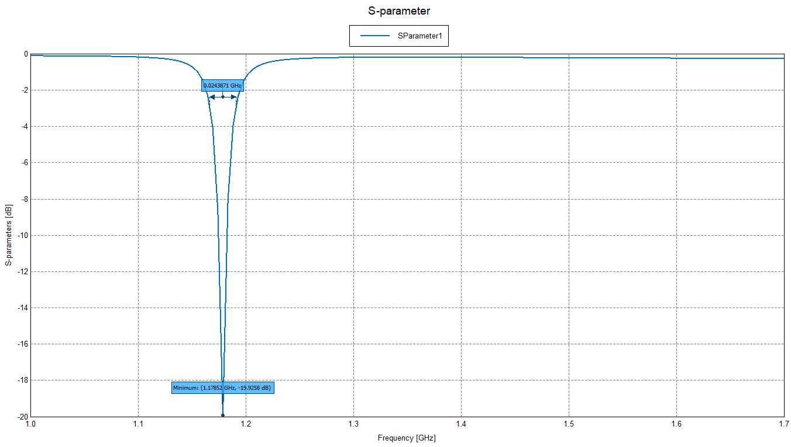

<h2>Overview</h2>
This project was carried on during the course of "Antenna and microwaves".
The objective was to realize resonators using coupled resonators.

The resonators were designed using FEKO, and realized on glass substrate using ink deposition.
The folder contains some images and measurements.

Some images:

Design and measurements:

