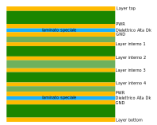
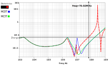
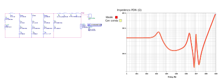

<h2>Overview</h2>
This project dealt with design of an embedded capacitance structure for fpga applications.
An insight on measurements using low-inductance methods was given in the context of power delivery network measurement.
The pdf contains a short presentation.

The embedded capacitance values and form were designed using Matlab and Altera tools.
The simulations were carried on using ADS software.

Some images:

measurements:
